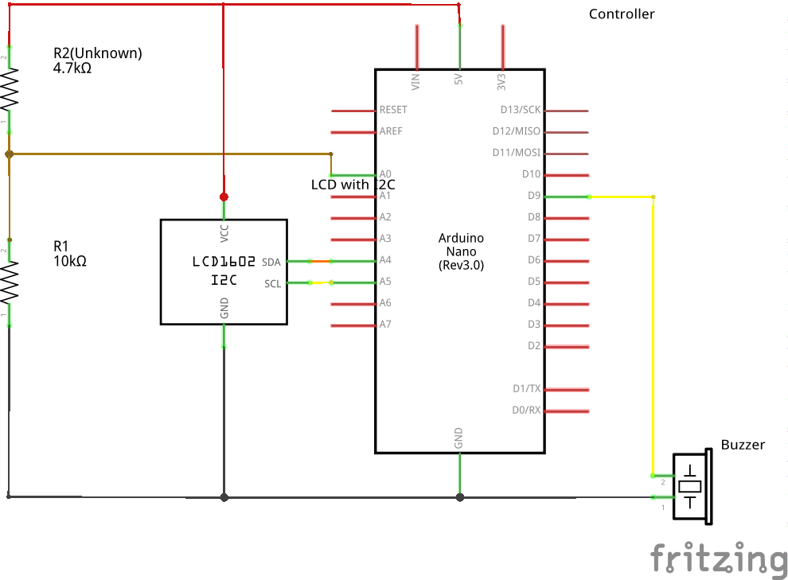

# Identify resistance of a resistor using Arduino

High-level Requirements:

  - Rq0001: Measure the resistance of the resistor under test
  - Rq0002: Measured resistance needs to be displayed on the attached display
  - Rq0003: Determine if the resistance measurement is close to expected value
  - Rq0004: Determine the measurements using multiple fixed value resistors
  - Rq0005: Signal the user by using Buzzer, when the measurement is complete

  - Rq1002: Find the optimal time for the measurements

  - Rq2001: Warn the user by using Display Notification as well
  - Rq2002: Ability to use multiple known resistors to increase
            the measurement range(preceeds Rq2002)

  - Rq3001: Ensure that device doesn't harm user during usage


```
Requirements Legend:
Rq0... => Functional Requirements
Rq1... => Non-functional Requirements
Rq2... => Nice-to-have Requirements
Rq3... => Regulatory / Legal Requirements
```

Folder Structure:

```
.
+-- pictures/
    +-- identifyResistance_bb.png
    +-- identifyResistance_schem.png
    +-- identifyResistance_LCD_I2C_bb.png
    +-- identifyResistance_LCD_I2C_schem.png
    +-- identifyResistance_LCD_Parallel_bb.png
    +-- identifyResistance_LCD_Parallel_schem.png
+-- schematics/
    +-- identifyResistance.fzz
    +-- identifyResistance_LCD_I2C.fzz
    +-- identifyResistance_LCD_Parallel.fzz
+-- src/
    +-- identRes/
        +-- identRes.ino
+-- README.md
```

Build & Flash:
  - Linux in headless mode (no GUI):
      \# arduino --upload src/identRes/identRes.ino --port /dev/ttyACM0
  - Linux with GUI:
      Open arduino software and select board and port
      Open the project file from the above folder structure
      Compile and Flash


Note: the serial port might be different, check dmesg after u plug in Arduino
      to identify the serial port


Required Components:
  - Arduino NANO (ATMega328p)
  - Display (LCD16x2 with I2C(LCM1602))
  - Buzzer
  - Multiple Resistors (preferably a set of assorted resistor box)
  - Breadboard
  - Connecting wires (Jumper cables)

<br/>

# Brief Overview:
  - This program's main goal is to display the resistance of the resistor on an LCD Display.
  - Added support for using LCD in both Parallel and in Serial(I2C) mode.
  - Added support for debugging the program via Serial Interface(UART).
  - Buzzer buzzes for a very short interval of time during the Initialization.
  - Serial debug can be enabled/disabled in the program by selecting appropriate flag value.
  - Delay between two RAW ADC measurements is 100ms.
  - Buzzer buzzes for a very short interval of time once the measurement is stabilized.
  - When the resistance is out-of-bounds, Display will show 0 Ohm.
  - Acceptable resistance range is 100 Ohm to 10KOhm.

<br/>

# Schematics:
## LCD with I2C Interface


## LCD with Parallel Interface


<br/>

# Breadboard:
## LCD with I2C Interface


## LCD with Parallel Interface


<br/>

# Measurement Limits
Limits for the measurable resistance values with an optimal accuracy:
  - 100 Ohm to 10 KOhm
